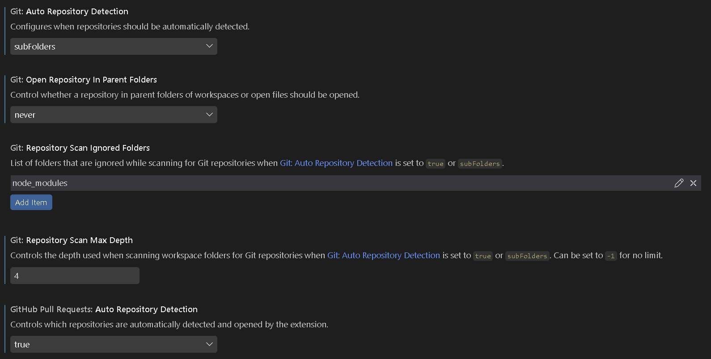

# matthew_summer26

## Setup instructions

### VsCode setup

-goto settings, enter git repository managers and change everything to look as such:

-goto your version control system button on the sidebar, and select "pick a repo" (or whatever) and select "matthew_summer26"

### How to run Makerspet packages

to run makerspet packages, simply use the commands given from their resources and type them at the root level (at :/#)

Ex : root@da15bf37667e:/# ros2 launch kaiaai_bringup physical.launch.py

### How to run MY packages

to run My packages, cd to "ros_ws/src/matthew_summer26/" and then run as usual

## My Packages

> **NOTE: ALL OF MY PACKAGES REQUIRE THE PHYSICAL BRINGUP FROM MAKERSPET TO BE RUNNING IN A SEPERATE TERMINAL!**

### Matthew Teleop -

a simple package meant to provide basic teleop functionality 

to run: "ros2 run matthew_teleop teleop"  

Ex : root@da15bf37667e:/ros_ws/src/matthew_summer26# ros2 run matthew_teleop teleop